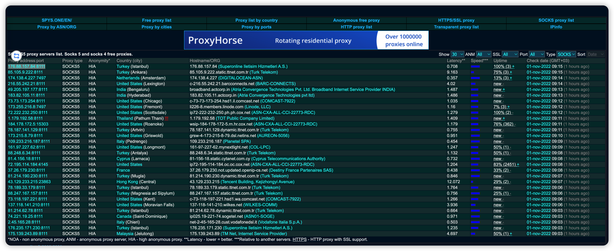

# 关于Socks5 

Socks是一个比较常见的http代理协议，利用shadowsocks、v2ray等常见的代理软件均借用了socks相关的协议，网络上开放了很多公开的socks5协议

- https://spys.one/en/socks-proxy-list/

  

- 一个简单的echo server ， 后面会利用echo server 来测试代理的流程
```rust

    async fn echo_server() -> Result<u32> {
        let listener = TcpListener::bind("0.0.0.0:9999").await?;
        loop {
            let (mut stream, _) = listener.accept().await?;
            
            tokio::spawn(async move {
                let (mut reader, mut writer) = stream.split();
                copy(&mut reader, &mut writer).await.unwrap();
            });
        }
        Ok(1)
    }


    #[test]
    fn test_echo_server() -> Result<()> {
        let run_time = Runtime::new()?;
        
        run_time.block_on(echo_server());
        Ok(())
    }

```


